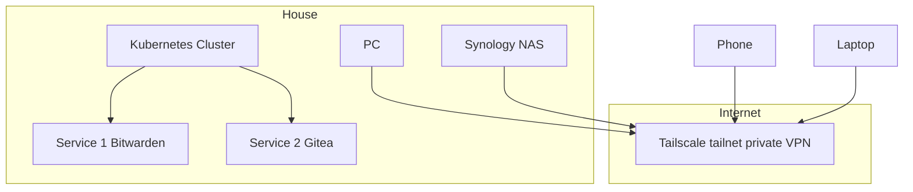
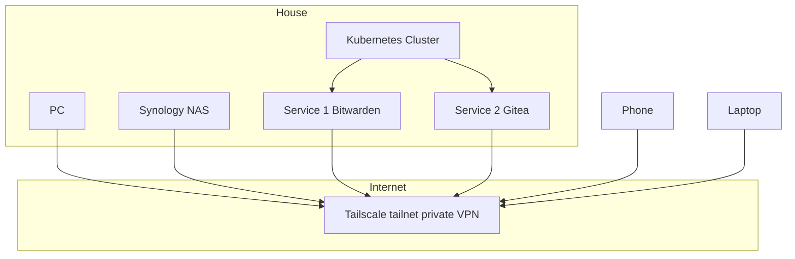

## Audience
Kubernetes Homelab users, Tailscale users

<!---->
<div style="position:relative;overflow:hidden;width:100%;padding-top:46%">
<iframe frameBorder="0" style="position:absolute;top:0px;left:0px;width:100%;height:100%" src="http://clarkezonedevbox5-tr:4000/static/img/2023-tailscaleoperator/index.html">
</iframe>
</div>

## Introduction
In this post I tell the story of my attempt to replace an <a href="https://q6o.to/bpdbk3sts" target="_blank">existing workable but cumbersome solution for Tailscale traffic routing</a> for my Kubernetes homelab with the simplicity and elegance of the <a href="https://q6o.to/bptsk8sop" target="_blank">Tailscale Operator for Kubernetes</a>.  Along the way I share learnings about a compatibility gotcha with recent Ubuntu distros including the work-around, as well as a mini tutorial on deploying a private version of the operator from source.  I cover both the existing incarnation of the Tailscale operator which supports Kubernetes Services (OSI L3) as well as the <a href="https://q6o.to/ghptsc9048" target="_blank">awesome new L7 ingress capability that was recently merged</a>.

## Tailscale X Kubernetes
If you are reading this post you are very likely an existing <a href="https://q6o.to/tsca" target="_blank">Tailscale</a> user or at least familiar with the tech.  I'm also assuming you know the basics of Kubernetes, and you may well be selfhosting one or more clusters at home.  Personally speaking, I'm deep down the rabbit hole with multiple self-hosted clusters running <a href="https://q6o.to/k3sa">k3s</a> as my Kubernetes distro of choice.

Outside of learning Linux and Kubernetes, I have embraced homelabs as part of my strategy to regain control over my digital estate.  I self-host Bitwarden, Home Assistant, Gitea, a private instance of docker hub and much more and this is where my interest in the union of Kubernetes selfhosting and Tailscale comes about.

The services I host are largely private in the sense that they don’t need to be internet visible but they do need to be reachable from all devices.  Putting these services on the tailnet that connects all devices makes them available securely everywhere without the need or risks inherent of exposing them on the internet.  It's a bit like a virtual private intranet.

> If you are selfhosting services in another manner such as using Docker on a Synology home NAS, Tailscale is still worth checkout out as these scenarios are <a href="https://q6o.to/tsckb1131" target="_blank">natively supported</a>.

The technique I've been using to expose services from Kubernetes clusters to my tailnet is one learned from <a href="https://q6o.to/davidsbond" target="_blank">David Bond</a> in <a href="https://q6o.to/bpdbk3sts" target="_blank">in this post from 2020</a>.  In David's approach (simplified here for brevity), each cluster node is individually joined to your tailnet and the cluster itself uses the tailnet for intra-node communication.




Name resolution and ingress come via public Cloudflare DNS entries for inbound traffic secured by Let's Encrypt for SSL certificates and routed to cluster nodes via the k3s Traefik ingress controller.  This approach works but requires multiple services to be installed and configured on the cluster, each node must be on the tailnet and DNS config is manual and external to the home network.  Definitely sub-optimal.

> If you are a Tailscale user playing with homelab setups would love to hear from you  <a href="https://q6o.to/czt" target="_blank">`X Twitter`</a> or <a href="https://q6o.to/czm" target="_blank">`Mastodon`</a>.

## Tailscale Operator

<div id="canvasholder" style="width:100%;height:400px;">
</div>
<script> 
ch = document.getElementById("canvasholder");
el = document.createElement("canvas");
el.style.width="100%";
el.style.heigh="400px";
ch.appendChild(el);

class Matrix {
            constructor(canvasthing) {
                this.canvas = canvasthing;
                this.ctx = this.canvas.getContext('2d');
                this.init();
            }

init() {
                this.font_size = 20;
                this.columns = Math.floor(this.canvas.width / this.font_size);
                this.matrix = Array(this.columns).fill(1);
                this.PROBABILITY_SVG = 0.7;
                this.PROBABILITY_RESET = 0.875;
                this.TICKS_BEFORE_UPDATE = 5;
                this.tickCounter = 0;
                this.images = [];
                this.imagesLoaded = 0;

const svgData = {
                    'circle': 'data:image/svg+xml;base64,' + btoa('<svg xmlns="http://www.w3.org/2000/svg" width="100" height="100"><circle cx="50" cy="50" r="40" fill="#0F0"/></svg>'),
                    'square': 'data:image/svg+xml;base64,' + btoa('<svg xmlns="http://www.w3.org/2000/svg" width="100" height="100"><rect x="10" y="10" width="80" height="80" fill="#0F0"/></svg>')
                };

                for (const svg in svgData) {
                    const img = new Image();
                    img.src = svgData[svg];
                    img.onload = () => {
                        this.images.push(img);
                        this.imagesLoaded++;
                        if (this.imagesLoaded === Object.keys(svgData).length) {
                            this.start();
                        }
                    };
                }
            }

            draw() {
                this.ctx.fillStyle = 'rgba(0, 0, 0, 0.05)';
                this.ctx.fillRect(0, 0, this.canvas.width, this.canvas.height);
                this.ctx.fillStyle = '#0F0';
                this.ctx.font = this.font_size + 'px arial';

                this.tickCounter++;

                if (this.tickCounter >= this.TICKS_BEFORE_UPDATE) {
                    this.matrix = this.matrix.map((y, x) => {
                        let newY = y;

                        if (Math.random() > this.PROBABILITY_SVG) {
                            const randomImage = this.images[Math.floor(Math.random() * this.images.length)];
                            this.ctx.drawImage(randomImage, x * this.font_size, y * this.font_size, this.font_size, this.font_size);
                            newY = y + 1;
                        } else {
                            const text = String.fromCharCode(0x30A0 + Math.random() * (0x30FF - 0x30A0 + 1));
                            this.ctx.fillText(text, x * this.font_size, y * this.font_size);
                        }

                        if (y * this.font_size > this.canvas.height && Math.random() > this.PROBABILITY_RESET) newY = 0;

                        return newY;
                    });
                    this.tickCounter = 0;
                }
            }

            start() {
                setInterval(() => this.draw(), 16);
            }
        }

new Matrix(el);

</script>
    
The Tailscale Operator vastly simplifies this picture by enabling a single extension to be installed into the cluster which then exposes the desired services to the tailnet with simple annotations of existing Kubernetes manifests.


The feature <a href="https://q6o.to/bptsk8sop" target="_blank">went into preview</a> earlier this year and I got further hyped about it talking to <a href="https://q6o.to/maisenali" target="_blank">Maism Ali</a> at Tailscale Up in May 2023 but it was only over the last few days (writing this on Sunday July 30th 2023) that I finally got around to trying the operator out in my setup.

The attraction of the Tailscale operator is that it is possible to expose any Kubernetes services in your tailnet without the need to install any other cluster components.  In my case it replaces the complexity of building out clusters with Tailscale on every node, and gives simple DNS setup via magic DNS and I don't need to install another ingress controller.  The remaining gap, which is supposedly in the roadmap, is a solution for L7 ingress with built in SSL.

 > After writing the above, <a href="https://q6o.to/ghptsc9048" target="_blank">Maisam submitted a patch to add ingress support</a> which fully addresses the above gap.  I cover that later in the post.

## Kicking the tyres
I started off by following the seemingly simple instructions outlined in the <a href="https://q6o.to/bptsk8sop" target="_blank">Kubernetes Operator kb entry</a>.  I installed the operator and then created a simple nginx deployment and service to test it out:

```yaml
apiVersion: v1
kind: Namespace
metadata:
  name: tailscaletest

---

apiVersion: apps/v1
kind: Deployment
metadata:
  name: nginx-tailscale
  namespace: tailscaletest
  labels:
    app: nginx-tailscale
spec:
  selector:
    matchLabels:
      app: nginx-tailscale
  replicas: 2 # tells deployment to run 2 pods matching the template
  template:
    metadata:
      labels:
        app: nginx-tailscale
    spec:
      containers:
      - name: nginx-tailscale
        image: nginx:1.20-alpine
        ports:
        - containerPort: 80

---

apiVersion: v1
kind: Service
metadata:
  name: nginx-tailscale
  namespace: tailscaletest
spec:
  type: LoadBalancer
  loadBalancerClass: tailscale
  ports:
  - port: 80
  selector:
    app: nginx-tailscale
```

The basic premise is that, having installed the operator into the cluster, a Kubernetes service object annotated with `loadBalancerClass: tailscale` will be detected by the operator and automatically exposed on your tailnet.  Only in my case, it didn't.

## A glitch in The Matrix

Long story short, the operator didn't work out of the box with my setup.


Testing initially took place on a k3s test cluster running ARM64 Ubuntu 22.04 and I documented my findings in this issue:
<a href="https://q6o.to/ghitsc8735" target="_blank">https://github.com/tailscale/tailscale/issues/8733</a>.  The short form was that although the Tailscale operator installed fine and was correctly detecting my test service, it wasn't able to correctly route traffic to the Kubernetes service through my tailnet.

Since I now found myself blocked with the Operator solution, I decided to try some of the <a href="https://q6o.to/tsckb1185" target="_blank">other Kubernetes solutions that Tailscale offers</a>.  Whilst not as elegant as the operator, both the Proxy and Sidecar approaches can achieve a similar result albeit with increasingly more manual steps.  The result of that testing was:

1. Tailscale Proxy for Kubernetes doesn't work
2. Tailscale Sidecar for Kubernetes did work

At that point in the journey, of all Tailscale Kubernetes options, only the Sidecar approach worked for my particular configuration.  Whilst providing helpful information about the state of the solution space, the Sidecar approach wasn't going to be a viable solution for my needs so I decided to double click on the two broken cases and try and figure out what was going wrong.

## Digging in
Doing some spelunking around in various issues and code, I was able to identify the following relevant issues in the Tailscale repo:

- <a href="https://q6o.to/ghitsc8111" target="_blank">https://github.com/tailscale/tailscale/issues/8111</a>
- <a href="https://q6o.to/ghitsc8244" target="_blank">https://github.com/tailscale/tailscale/issues/8244</a>
- <a href="https://q6o.to/ghitsc5621" target="_blank">https://github.com/tailscale/tailscale/issues/5621</a>
<a href="https://q6o.to/ghitsc391" target="_blank">- https://github.com/tailscale/tailscale/issues/391</a>
- <a href="https://github.com/tailscale/tailscale/issues/391" target="_blank">https://github.com/tailscale/tailscale/issues/391</a>
- <a href="https://q6o.to/se588998" target="_blank">https://unix.stackexchange.com/questions/588998/check-whether-iptables-or-nftables-are-in-use/589006#589006</a>

and from there derive the following learnings:

1. `iptables` provides firewall and route configuration functionality on Linux. Due to limitations (performance and stability) a more modern alternative called `nftables` was developed.  More details here: <a href="https://q6o.to/ipvsnft" target="_blank">https://linuxhandbook.com/iptables-vs-nftables/</a>
2. Since only one implementation is installed / active on a host at one time, it is necessary to detect which is running and use appropriate API's.
3. Older versions of Ubuntu such as 20.04 use the `iptables` implementation where-as 22.04 moved to `nftables`.
4. Lack of support for `nftables` in the current Tailscale implementation being a common problem.  This impacts tailscale compatibility when running on more recent OS which may default to using `nftables` rather than `iptables`.
5. This is not a new thing.  The KubeProxy previously had to accommodate this situation back in 2018 as mentioned in this issue <a href="https://q6o.to/ghik8s71305" target="_blank">https://github.com/kubernetes/kubernetes/issues/71305</a>
6. On the Tailscale side, an `nftables` patch recently landed adding support for `nftables` albeit experimental and behind a tailscaled flag.
<a href="https://q6o.to/ghptsca8555" target="_blank">https://github.com/tailscale/tailscale/pull/8555</a>
7. Full support for nfttables in tailscaled including auto-detection is still in progress, not on by default and not available for Kubernetes scenarios.

> At the original time of writing, auto-detection and switching for `iptables` and `nftables` hadn't been built, it has subsequently landed behind a flag

From doing some spelunking around the source in the Tailscale repo:

1. The code entrypoint for Tailscale Kubernetes operator lives in `operator.go`
2. The operator's job is to create a Kubernetes statefulset for every service annotated with `type: LoadBalancer`, `loadBalancerClass: tailscale`
3. The statefulset is instantiated from the docker image `tailscale/tailscale` which turns out to be the self-same container image as used by the Tailscale Kubernetes Proxy approach.  From my testing Proxy was a non working case in my setup.
4. The `tailscale/tailscale` docker image is essentially a wrapper around backed by `tailscaled` is configured and run in all container scenarios
5. The code entrypoint for the `tailscale/tailscale` docker image is `containerboot.go` 

Interesting stuff.  Based on the above, first step was to set about verifying that Ubuntu 22.04 does indeed run on `nftables`. I duly ssh'd into one of my cluster nodes, ran `iptables -v` with the following results confirming that 22.04 does indeed run on `nftables`:

Ubuntu 22.04
```bash
james@rapi-c4-n1:~$ lsb_release -a
No LSB modules are available.
Distributor ID: Ubuntu
Description:    Ubuntu 22.04.2 LTS
Release:        22.04
Codename:       jammy
james@rapi-c4-n1:~$ iptables -V
iptables v1.8.7 (nf_tables)
james@rapi-c4-n1:~$ 
```
Repeating on a 20.04 node, in this case it's running on `iptables`:

Ubuntu 20.04
```bash
james@rapi-c1-n1:~$ lsb_release -a
No LSB modules are available.
Distributor ID: Ubuntu
Description:    Ubuntu 20.04.5 LTS
Release:        20.04
Codename:       focal
james@rapi-c1-n1:~$ iptables -V
iptables v1.8.4 (legacy)
```
The overall hypothesis from all of the above research is that my issue is the lack of `nftables` support in tailscaled is biting me due to the fact I'm running on Ubuntu 22.04 on my cluster nodes which defaults to `nftables`.

## Testing the hypothetical fix
Since it looked like my issue was lack of `nftables` support out-of-the-box Tailscale and, as luck would have it, experimental support is supposedly there behind a disabled flag, I set about testing this out to see if it could unblock me.  The approach was:

1. forcing on the `TS_DEBUG_USE_NETLINK_NFTABLES` flag in `wengine/router/router_linux.go`
2. build a private copy of the tailscale/tailscale container image
3. verify this image with Tailscale proxy since the implementation is shared with the Operator and the scenario is simpler
4. if yes, test image with Tailscale Operator

The result of working through these steps was the following private fork: <a href="https://q6o.to/ghcnftopf" target="_blank">https://github.com/clarkezone/tailscale/commits/nftoperatortestfix</a> the testing of which proved very fruitful.  In summary, the `nfttables` support worked as expected.  Since others had cited this problem, I decided to be a good opensource citizen and submit a PR: <a href="https://q6o.to/ghptsc8749" target="_blank">https://github.com/tailscale/tailscale/pull/8749</a>.

As the ongoing work on <a href="https://q6o.to/ghitsc5621" target="_blank">https://github.com/tailscale/tailscale/issues/5621</a> continues to land (eg <a href="https://q6o.to/ghptsc8762" target="_blank">https://github.com/tailscale/tailscale/pull/8762</a>) the need for my fix will go away as the scenario will just work, but until then it's a temporary stop-gap for those blocked on adopting the Tailscale Kubernetes Operator.

If you want to follow along you can do the following:

To try it out

1. (optional) build client docker image substituting appropriate repos and tags: `PUSH=true REPOS=clarkezone/tsopfixtestclient TAGS=6 TARGET=client ./build_docker.sh`
2. (optional) build operator docker image substituting appropriate repos and tags: `PUSH=true REPOS=clarkezone/tsopfixtestoperator TAGS=3 TARGET=operator ./build_docker.sh
`
3. Grab manifest from this branch: `curl -LO https://github.com/clarkezone/tailscale/raw/nftoperatortestfix/cmd/k8s-operator/manifests/operator.yaml`
4. add your clientID and secret per the <a href="https://q6o.to/bptsk8sop" target="_blank">official instructions</a>
5. (optional) if you built and pushed your own containers, update line 130 and 152 to point to your private images
6. Apply the operator manifest: `kubectl apply -f operator.yaml`
7. apply test manifests to publish a nginx server on tailnet: `kubectl apply -f https://gist.github.com/clarkezone/b22a5851f2e4229f5fd29f1115ddee32/raw/277efaa5e099ef055eb445115dd199dc40829df2/tailscaleoperatortest.yaml`
8. Get the endopoint address for the service on your tailnet with `kubectl get services -n tailscaletest` in the external IP column, you should see a dns entry in your tailnet similar to tailscaletest-nginx-tailscale.tail967d8.ts.net, this is the endpoint your service is exposed on.
9. You should be able to curl the endpoint and see output from nginx: `curl tailscaletest-nginx-tailscale.tail967d8.ts.net`

## Adding Ingress
The ultimate solution I've been looking for with a Tailscale Operator type of solution is something that works at the http layer and supports DNS and SSL integration to enable a better more secure user experience for connecting to clusters.  Over the course of writing this post, my wish came try when Maism landed the <a href="https://q6o.to/ghptsc9048" target="_blank">initial PR that adds ingress support to the Tailscale Operator</a>.  This provides the final missing link I was looking for. So this post wouldn't be complete with a quick tour of that.  It's also worth noting that because Ingress support doesn't depend on the iptables or nftables layer, my original issue is also solved without any of the concerns I've articulated above. 

In order to leverage Ingress support, the earlier example is modified by removing annotation from the service and adding an ingress manifest with a modified tailscale annotation:
```yaml
apiVersion: v1
kind: Namespace
metadata:
  name: tailscaletest

---

apiVersion: apps/v1
kind: Deployment
metadata:
  name: nginx-tailscale
  namespace: tailscaletest
  labels:
    app: nginx-tailscale
spec:
  selector:
    matchLabels:
      app: nginx-tailscale
  replicas: 2 # tells deployment to run 2 pods matching the template
  template:
    metadata:
      labels:
        app: nginx-tailscale
    spec:
      containers:
      - name: nginx-tailscale
        image: nginx:1.20-alpine
        ports:
        - containerPort: 80

---

apiVersion: v1
kind: Service
metadata:
  name: nginx-tailscale
  namespace: tailscaletest
spec:
  ports:
  - port: 80
  selector:
    app: nginx-tailscale

---

apiVersion: networking.k8s.io/v1
kind: Ingress
metadata:
  name: nginx-tailscale
  namespace: tailscaletest
spec:
  ingressClassName: tailscale
  tls:
  - hosts:
    - "foo"
  rules:
  - http:
      paths:
      - path: /
        pathType: Prefix
        backend:
          service:
            name: nginx-tailscale
            port:
              number: 80
```

If you apply the above to a cluster with the latest operator installed, via

`kubectl apply -f https://gist.github.com/clarkezone/f99ea7f0c08a4f0f7a2487cc73871b89`

you will see something simlar to this:

```bash
k get ingress -n tailscaletest nginx-tailscale
NAME              CLASS       HOSTS   ADDRESS                       PORTS     AGE
nginx-tailscale   tailscale   *       nginx-test.tailxxxx.ts.net   80, 443   7m52s
```

Assuming you have Tailscales' wonderful <a href="https://q6o.to/tsckb1081" target="_blank">MagicDNS</a> enabled, you can now visit https://nginx-test.tailxxxx.ts.net from the browser of any device on your tailnet and get SSL secured access to your cluster.  Mission accomplished!  Thx Maisem!

## Next steps
There is an additional feature that enables Tailscale to perform the duties of an authenticating proxy for the k8s control plane which sounds interesting and I plan to try out at some point.

For the scenario of enabling one cluster to access other tailnet resources, there is also an egress proxy solution that I need to look at.

## Wrap-up

Thanks for reading this far!  I hope you've been able to learn something new.  Would love to know how you get on your journey into the fun world of Containers, Kubernetes and Tailscale.  Stay in touch here <a href="https://q6o.to/czt" target="_blank">`x Twitter`</a> or <a href="https://q6o.to/czm" target="_blank">`Mastodon`</a>
